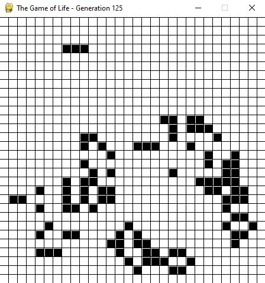

# Conway's Game of Life

My build of the **Game of Life**, a cellular automata devised by John Conway in the 70s. **Life** isn't just interesting to computer sciences, but also to physicists interested in phase transitions. On this topic, I found an interesting paper called [Self-organized criticality in the 'game of Life'](https://journals.aps.org/pre/abstract/10.1103/PhysRevE.49.R2507). Given how interesting cellular automata are, I may add other attempts here - in particular, Langton's Ant.

The universe of the game is an infinite, two-dimensional orthogonal grid of square cells and it is governed by the following rules:

* Any live cell with two or three live neighbours survives.
* Any dead cell with three live neighbours becomes a live cell.
* All other live cells die in the next generation. Similarly, all other dead cells stay dead.
